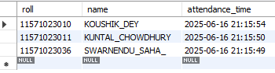

# Smart Exam Hall Attendance System

A real-time AI-powered face recognition system that automates student attendance verification in examination halls using MTCNN and FaceNet, eliminating manual processes and preventing proxy attendance.

---

## Problem Statement

Traditional exam hall attendance systems face several critical challenges:

- **Time-Consuming Manual Process**: In large-scale examinations with hundreds or thousands of students, manual attendance marking consumes 15-20 minutes of valuable exam time.
- **Proxy Attendance & Impersonation**: Students can easily send proxies to write exams on their behalf, compromising academic integrity and fairness.
- **Human Error**: Manual verification is prone to errors, especially when invigilators handle multiple responsibilities simultaneously.
- **Lack of Digital Records**: Paper-based attendance registers are difficult to maintain, retrieve, and audit, leading to disputes and inefficiencies.
- **Post-Pandemic Safety Concerns**: Physical contact during ID verification and attendance marking poses health risks.
- **Scalability Issues**: Traditional methods don't scale well for institutions conducting exams across multiple halls and centers.

These inefficiencies not only waste time but also undermine the credibility of the examination process, creating a need for an automated, secure, and contactless solution.

---

## Solution

The **Smart Exam Hall Attendance System** leverages cutting-edge computer vision and deep learning technologies to provide:

✅ **Automated Face Recognition**: Students are identified instantly using facial recognition as they enter the exam hall.  
✅ **Real-Time Verification**: Live webcam feed continuously detects and matches faces against a pre-registered database.  
✅ **Contactless Operation**: No physical interaction required—students simply walk past the camera for verification.  
✅ **Instant Attendance Logging**: Attendance is marked automatically with precise timestamps in a MySQL database.  
✅ **Proxy Prevention**: Unknown or unregistered faces are flagged immediately, preventing impersonation.  
✅ **Admin Dashboard**: Tkinter-based GUI allows administrators to view, export, and manage attendance records.  
✅ **Scalable & Cost-Effective**: Works with standard webcams and computers, making it deployable in any institution.

This system not only saves time but also enhances the security, transparency, and efficiency of the examination process.

---

## Features

- 📸 **Web-Based Student Registration Portal** – Students register with their details and upload facial images via a Flask interface.
- 🔍 **Real-Time Face Detection** – Uses MTCNN (Multi-task Cascaded Convolutional Networks) to detect faces under varying lighting conditions.
- 🧠 **Deep Learning Face Recognition** – FaceNet generates 128-dimensional embeddings for accurate student identification.
- ✅ **Automated Attendance Logging** – Matches detected faces with the database and logs attendance with timestamps.
- 🚫 **Proxy & Impersonation Detection** – Flags unregistered or unknown faces immediately.
- 🖥️ **Admin Dashboard (GUI)** – Tkinter interface for downloading attendance reports, managing records, and admin authentication.
- 📊 **Attendance Export** – Download attendance data in Excel/CSV format for record-keeping.
- 🔒 **Secure MySQL Database** – Student information and attendance records stored securely.
- ⚡ **Fast Processing** – Real-time face recognition with minimal latency (< 200ms per frame).
- 📂 **Organized File Storage** – Student photos saved in structured folders for easy retrieval.

---

## Tech Stack

| **Category**              | **Technology**                                                                 |
|---------------------------|--------------------------------------------------------------------------------|
| **Programming Language**  | Python 3.x                                                                     |
| **Web Framework**         | Flask (for student registration portal)                                        |
| **GUI Framework**         | Tkinter (for admin dashboard)                                                  |
| **Face Detection**        | MTCNN (Multi-task Cascaded Convolutional Networks)                             |
| **Face Recognition**      | FaceNet (128-dimensional facial embeddings)                                     |
| **Computer Vision**       | OpenCV (real-time video processing)                                             |
| **Deep Learning**         | TensorFlow, Keras                                                              |
| **Database**              | MySQL (attendance and student information storage)                              |
| **Other Libraries**       | NumPy, SciPy, Pillow (PIL), mysql-connector-python                              |
| **Development Tools**     | VS Code, StarUML (for system design)                                            |
| **Hardware Requirements** | Webcam, Standard PC/Laptop (Intel i3+, 8GB RAM, 64-bit OS)                      |

---

## Project Structure

```
Smart-Exam-Hall-Attendance-System/
│
├── app/                      # Flask application modules
├── gui/                      # Tkinter admin dashboard files
├── Pictures/                 # Stored student facial images (organized by roll number)
├── static/                   # CSS, JavaScript for web interface
├── templates/                # HTML templates for Flask
├── exports/                  # Exported attendance reports (Excel/CSV)
├── screenshot/               # System screenshots and demo images
│
├── Create_embedding.py       # Generates FaceNet embeddings for registered students
├── Test_The_Model.py         # Model testing and validation script
├── app.py                    # Flask web server for student registration
├── main.py                   # Main face recognition and attendance marking system
├── requirements.txt          # Python dependencies
├── test_embeddings.npy       # Pre-computed embeddings for testing
├── .gitignore                # Git ignore rules
└── README.md                 # Project documentation
```

---

## How It Works (System Workflow)

1. **Student Registration**  
   - Students access the Flask-based registration portal.
   - They enter their roll number, name, and stream (course).
   - A clear facial photo is captured via webcam and saved in the `Pictures/` folder.
   - Student details are stored in the MySQL `students_info` table.

2. **Embedding Generation**  
   - The system runs `Create_embedding.py` to generate 128-dimensional FaceNet embeddings for all registered students.
   - Embeddings are stored for fast real-time comparison.

3. **Exam Hall Attendance Marking**  
   - During the exam, `main.py` is launched to start the attendance system.
   - A webcam continuously captures live video of students entering the hall.
   - **MTCNN** detects faces in each frame.
   - **FaceNet** generates embeddings for detected faces.
   - **Cosine Similarity** compares live embeddings with stored embeddings.
   - If similarity exceeds the threshold (e.g., 0.75), the student is recognized.

4. **Attendance Logging**  
   - Once recognized, the student's roll number, name, and attendance timestamp are recorded in the MySQL `attendance` table.
   - Duplicate entries are prevented within the same session.

5. **Admin Dashboard**  
   - Administrators use the Tkinter GUI to:
     - View attendance records
     - Download reports in Excel format
     - Delete old records
     - Manage student data

6. **Unknown Face Handling**  
   - If no match is found, the face is flagged as "Unknown," alerting administrators of a potential proxy.

---

## Installation & Setup

Follow these steps to set up the project on your local machine:

### Prerequisites

- **Python 3.8 or higher** installed on your system
- **MySQL Server** installed and running
- **Webcam** connected to the system
- **Git** (optional, for cloning)

---

### Step 1: Clone the Repository

```bash
git clone https://github.com/Gopi360/Smart-Exam-Hall-Attendance-System.git
cd Smart-Exam-Hall-Attendance-System
```

---

### Step 2: Install Python Dependencies

```bash
pip install -r requirements.txt
```

**Note**: If you encounter issues, use:

```bash
pip install --upgrade pip
pip install -r requirements.txt
```

---

### Step 3: Set Up MySQL Database

1. **Open MySQL and create a new database**:

```sql
CREATE DATABASE exam_attendance;
USE exam_attendance;
```

2. **Create the `students_info` table**:

```sql
CREATE TABLE students_info (
    roll VARCHAR(50) PRIMARY KEY,
    name VARCHAR(100),
    stream VARCHAR(100),
    photo_filename VARCHAR(255)
);
```

3. **Create the `attendance` table**:

```sql
CREATE TABLE attendance (
    roll VARCHAR(50) PRIMARY KEY,
    name VARCHAR(100),
    attendance_time DATETIME
);
```

---

### Step 4: Configure Database Connection

Open the relevant Python files (`app.py`, `main.py`) and update the MySQL connection details:

```python
import mysql.connector

conn = mysql.connector.connect(
    host="localhost",
    user="your_mysql_username",    # Change this
    password="your_mysql_password", # Change this
    database="exam_attendance"
)
```

---

### Step 5: Run the Registration Portal (Flask)

Start the Flask web server for student registration:

```bash
python app.py
```

- Open your browser and navigate to `http://localhost:5000`
- Register students by entering their details and capturing their photos

---

### Step 6: Generate Embeddings

After registering students, run the embedding generation script:

```bash
python Create_embedding.py
```

This will create FaceNet embeddings for all registered students.

---

### Step 7: Run the Attendance System

Launch the face recognition system for real-time attendance marking:

```bash
python main.py
```

- The webcam will activate and start detecting faces
- Recognized students will be automatically marked present

---

### Step 8: Access Admin Dashboard

Run the Tkinter GUI to view and manage attendance:

```bash
python gui/admin_dashboard.py
```

**Admin Features**:
- View attendance records
- Download reports as Excel files
- Delete old records
- Admin login authentication

---

## Screenshots

### 1. Student Registration Portal


### 2. Real-Time Face Detection


### 3. Admin Dashboard


### 4. Attendance Report


---

## Database Schema

### Table: `students_info`

| Column          | Type          | Description                        |
|-----------------|---------------|------------------------------------|
| `roll`          | VARCHAR(50)   | Primary Key - Student roll number  |
| `name`          | VARCHAR(100)  | Student name                       |
| `stream`        | VARCHAR(100)  | Course/stream (e.g., MCA, B.Tech)  |
| `photo_filename`| VARCHAR(255)  | Filename of stored facial image    |

---

### Table: `attendance`

| Column            | Type        | Description                          |
|-------------------|-------------|--------------------------------------|
| `roll`            | VARCHAR(50) | Primary Key - Student roll number    |
| `name`            | VARCHAR(100)| Student name                         |
| `attendance_time` | DATETIME    | Timestamp when attendance was marked |

---

## Usage Example

### Example Workflow:

1. **Registration Phase**:  
   - Student enters roll: `11571023034`, name: `Supriya Gope`, stream: `MCA`
   - Webcam captures face → Saved as `11571023034_Supriya_Gope.jpg`
   - Record inserted into `students_info` table

2. **Attendance Marking**:  
   - Student enters exam hall
   - Camera detects face → FaceNet generates embedding
   - Embedding matches with database (similarity: 0.89)
   - Record inserted into `attendance` table: `11571023034 | Supriya Gope | 2024-03-15 09:30:00`

3. **Unknown Face Detected**:  
   - Camera detects face → No match found (similarity: 0.42)
   - System flags as "Unknown" and alerts administrator

---

## Technologies Explained

### MTCNN (Multi-task Cascaded Convolutional Networks)
- **Purpose**: Detects faces in images/video frames
- **How it works**: Uses a cascade of three neural networks (P-Net, R-Net, O-Net) to progressively refine face detection
- **Advantages**: High accuracy, handles occlusions, works in varied lighting conditions

### FaceNet
- **Purpose**: Generates unique facial embeddings for recognition
- **How it works**: Converts facial features into a 128-dimensional vector (embedding) using deep neural networks
- **Advantages**: Highly discriminative, enables efficient face comparison using simple distance metrics

### Cosine Similarity
- **Purpose**: Measures similarity between two face embeddings
- **Formula**: `similarity = (A · B) / (||A|| × ||B||)`
- **Threshold**: If similarity ≥ 0.75, faces are considered a match

---

## Future Improvements

- 🔗 **IoT Integration**: Smart alerts and access control using IoT sensors
- ☁️ **Cloud Support**: Centralized attendance records accessible from anywhere
- 📱 **Mobile App**: Admin monitoring via Android/iOS apps
- 📊 **Advanced Analytics**: Graphical reports, trends, and anomaly detection
- 🧑‍💼 **Role-Based Access Control**: Multi-level admin privileges
- 🌐 **Multi-Camera Support**: Simultaneous monitoring of multiple exam halls
- 🔐 **Biometric Fusion**: Combine face recognition with fingerprint/iris scanning
- 🌍 **Multi-Language Support**: Interface in multiple languages

---

## Limitations & Challenges

- **Lighting Dependency**: Performance may degrade in very poor lighting conditions
- **Occlusion Handling**: Masks, sunglasses, or head coverings may affect recognition accuracy
- **Database Size**: As the number of students increases, matching time may slightly increase (mitigated by optimized embeddings)
- **Hardware Requirements**: Requires a decent webcam and processing power for real-time performance

---

## Contributors

This project was developed as a **Minor Project** for the **Master of Computer Applications (MCA)** degree at **B. P. Poddar Institute of Management and Technology** under the guidance of **Dr. Arijit Dey**.

**Team Members**:

| Name                  | University Roll No. | GitHub |
|-----------------------|---------------------|--------|
| **Srijita Mukherjee** | 11571023032         | -      |
| **Supriya Gope**      | 11571023034         | [@Gopi360](https://github.com/Gopi360) |
| **Shreya Chakraborty**| 11571023028         | -      |

**Guide**: Dr. Arijit Dey (Assistant Professor, Department of Computer Applications)

---

## Acknowledgements

We extend our sincere gratitude to:

- **Dr. Arijit Dey** for his invaluable guidance and support throughout this project
- **B. P. Poddar Institute of Management and Technology** for providing the resources and infrastructure
- **Maulana Abul Kalam Azad University of Technology, West Bengal** for the opportunity to work on this project
- The developers of **MTCNN**, **FaceNet**, and **OpenCV** for their open-source contributions

---

## License

This project is developed for academic purposes as part of the MCA curriculum. Feel free to use and modify the code for educational purposes with proper attribution.

---

## Contact

For queries, suggestions, or collaborations:

- **Supriya Gope**: [GitHub Profile](https://github.com/Gopi360)
- **Email**: supriyagope2002@gmail.com *(update with your actual email)*

---

## References

1. Roy, M.K., et al. (2024). "MTCNN and FaceNet-Based Face Detection and Recognition Model for Attendance Monitoring." *Human-Centric Smart Computing*, Springer.
2. Warman, G.P. & Kusuma, G.P. (2023). "Face Recognition for Smart Attendance System Using RetinaFace, MTCNN, FaceNet, and ArcFace." *Computers, Materials & Continua*.
3. Goodfellow, I., Bengio, Y., & Courville, A. (2016). *Deep Learning*. MIT Press.
4. Schroff, F., Kalenichenko, D., & Philbin, J. (2015). "FaceNet: A Unified Embedding for Face Recognition and Clustering." *CVPR 2015*.
5. Zhang, K., et al. (2016). "Joint Face Detection and Alignment Using Multitask Cascaded Convolutional Networks." *IEEE Signal Processing Letters*.

---

## Project Status

✅ **Completed** – Successfully defended and submitted as part of the MCA Minor Project (MCAN-381)

---

**⭐ If you find this project useful, please consider giving it a star on GitHub!**

---

**Made with ❤️ by Team Smart Attendance**